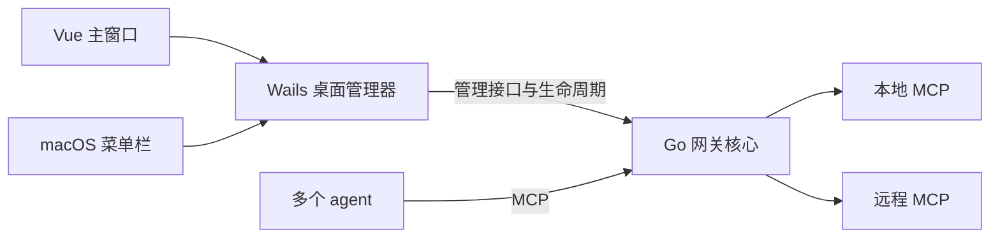

# MCP Gateway 桌面产品审核稿

日期：2026-09-06。版本：v0.2 设计草案。用途：审核功能、菜单栏与界面方向；尚未开发产品或改变本机 MCP 配置。

后续实施范围与完成标准统一见[项目目标（待审核）](project-goal.md)；本稿保留交互细节，不单独表示选型与生命周期已经批准。

## 已确认、建议与待定

| 类型 | 当前记录 |
| --- | --- |
| 已确认 | 本机集中管理与聚合 MCP；上游 OAuth2/token；渐进发现；可视化；本轮必须设计菜单栏并供用户审核 |
| 本轮明确的交互要求 | MCP 服务内展示 Tools；明确选择认证方式并显示相应字段；提供完整导入页面；主题包含 Light、Dark、跟随系统 |
| 用户提出的候选 | 如果采用 Go 网关，评估 Wails + Vue |
| 当前建议，未确认 | Wails v3 + Vue 3 + TypeScript 管理界面；优先复用 MCPProxy Go 独立核心；macOS 原生工具式布局 |
| 当前审核问题 | 关主窗口、退出管理器、停止网关分别发生什么 |
| 后续逐项讨论 | Wails v3 Beta 接受程度；选用 MCPProxy 或自研 SDK 核心；首批真实 MCP；导入和接入哪些 agent；工具授权粒度；原生菜单或富交互弹窗；视觉细节 |

上一轮的开源核验见[项目调研](research-existing-projects.md)，协议边界见[需求与方向](requirements-and-direction.md)，术语见[CONTEXT](../CONTEXT.md)。这些文档中的推荐不代表用户已作决定。

## Wails + Vue 可行性

**结论：可行，菜单栏需求更适合优先评估 Wails v3。** 官方提供 Vue TypeScript 模板、原生状态栏菜单、窗口绑定、窗口生命周期和登录启动 API。[Vue 模板](https://v3.wails.io/quick-start/first-app/)、[菜单栏 API](https://v3.wails.io/features/menus/systray/)、[生命周期](https://v3.wails.io/concepts/lifecycle/)、[登录启动](https://v3.wails.io/features/autostart/basics/)

**版本约束：当前 v3 是 Beta，v2 仍是稳定版本。** 本稿推荐 v3 的理由是已有原生菜单栏/多窗口能力，避免为 v2 额外拼接桌面生命周期方案；这不是“稳定性已验证”的结论。正式实现必须锁定具体版本，并验收休眠唤醒、关闭窗口、菜单点击和升级重启。[Wails 官方 Beta 公告](https://v3.wails.io/blog/wails-v3-beta/)

**Go 核心不等于可直接作为 Go 库嵌入。** MCPProxy 的现有核心大量位于仓库 `internal/`，本次尚未确认稳定可复用的嵌入 API。建议首版由 Wails 管理器控制一个打包随附的独立核心，通过已有管理 API 操作；agent 直接连接核心的 MCP 端点。不要让 agent 的每次工具调用绕经 Vue 或桌面桥接。[MCPProxy 源码结构](https://github.com/smart-mcp-proxy/mcpproxy-go/tree/9a946edf1f82bcf60e1c850ae5f5acd31eaa45e2/internal)、[现有独立核心入口](https://github.com/smart-mcp-proxy/mcpproxy-go/blob/9a946edf1f82bcf60e1c850ae5f5acd31eaa45e2/cmd/mcpproxy/main.go)



独立运行不自动意味着安装永久后台服务。是否使用独立 LaunchAgent，要由“退出管理器后是否继续运行”的选择决定。

## 首版必要功能

以下各项为建议的首版验收范围，编号用于审核反馈。

| 编号 | 功能 | 必须覆盖的行为 | 界面位置 |
| --- | --- | --- | --- |
| F01 | MCP 服务管理 | 添加、编辑、移除配置；启用/禁用；连接测试、重连；stdio / Streamable HTTP / 旧版 SSE；区分禁用、连接中、可用、待登录、错误 | 默认“服务”页 + 详情 |
| F02 | 配置收拢与去重 | 选择文件或粘贴配置；显示来源、冲突与差异；相同连接合并，不同账号/参数/环境/工作目录保留；迁移有备份且能恢复 | 导入向导 |
| F03 | 上游认证与凭证 | 无认证、token/API key、指定 header、stdio 环境凭证；OAuth 登录、取消、刷新、重新登录、清除本地授权；提供方需要时填 client ID；界面脱敏 | 服务详情的“连接与认证” |
| F04 | 统一入口与 agent 接入 | 显示网关地址；生成各 agent 的适配配置；应用前展示确切差异；检测可判定的配置/握手状态；不能凭进程存在就显示已接入 | “Agent 接入”页 |
| F05 | 工具目录与渐进发现 | 可检索服务/工具，按需查看 schema，少量稳定入口发现并调用；禁用工具在最终调用处仍被拒绝；可切换普通聚合模式以兼容原生发现 | “工具”页 + 设置 |
| F06 | 运行状态与排错 | 上游状态、最近错误、重连；调用的服务、真实工具、结果、耗时；查看脱敏详情；导出脱敏诊断信息；大型响应不静默截断 | “活动”页 + 服务详情 |
| F07 | 菜单栏与后台运行 | 状态项、打开主窗口、异常直达、服务启停、暂停新调用、恢复、重连异常服务、入口地址、设置、退出；窗口关闭不误停网关 | macOS 菜单栏 |
| F08 | 本机运行设置 | 仅绑定本机；管理接口与 MCP 入口认证分开；凭证存储边界明确；登录启动、外观、日志保留、当前版本和手动检查更新 | “设置”页 |

补充约束：

- Token 存储和 OAuth 刷新尽量使用核心已有实现；是否完整落入 Keychain 需要按最终版本验证，不能只凭“支持 keyring”做承诺。
- “清除本地授权”只清除本机保存的凭证；若要撤销远端授权，必须确认提供方支持并在产品中准确区分。
- 普通导出不携带明文凭证。导入已有凭证时不在预览里回显，不能把用户配置发到在线服务做解析。
- 使用真实工具身份校验禁用/权限规则，不能把通用调用入口整体标为只读。
- 管理页必须支持空状态、导入冲突、端口占用、启动失败和凭证过期；不能只有成功路径。
- 包管理器缺失时给出可执行的安装说明；首版不做自动安装、自动升级所有上游 MCP 的包管理平台。
- 自动更新、团队管理、项目隔离、云同步、工具市场、任意代码执行器不列入首版必要范围；有具体需求再加入。

## 菜单栏设计

默认建议采用 **macOS 原生菜单**，点击右上角单色状态图标展开。服务多时使用一个子菜单，不让菜单被几十个 MCP 撑满。完整编辑、OAuth 表单和日志在主窗口进行。

```text
[网关图标]
  MCP Gateway · 运行中
  4 个服务可用 · 2 项需要处理
  ──────────────────────────
  打开管理器…                      ⌘O
  需要处理                        ▸
      Notion · 需要登录
      Internal API · 连接失败
  MCP 服务                        ▸
      ✓ GitHub
      ✓ Context7
      ✓ Playwright
      ✓ Filesystem
      ✓ Notion             需要登录
      ✓ Internal API       连接失败
        PostgreSQL         已禁用
      管理全部服务…
  ──────────────────────────
  暂停新调用 / 恢复调用
  重连异常服务
  复制网关地址
  ──────────────────────────
  设置…                           ⌘,
  退出并停止网关                  ⌘Q
```

以上名称、服务、数量和快捷键均为草案示例，不表示已读取或接入用户的真实服务。子菜单勾选表示“启用配置”，不表示连接健康；右侧文本独立表示运行/认证状态。

| 操作/状态 | 建议行为 |
| --- | --- |
| 正常运行 | 单色模板图标，菜单文字说明状态；不持续闪烁或滚动数字 |
| 部分服务异常 | 图标有小感叹标识，菜单“需要处理”列出项目；其余服务照常使用 |
| 网关停止/暂停 | 图标与文字明确区分，主窗口和菜单同步 |
| 打开管理器 | 激活现有窗口；没有窗口时创建；重复点击不启动第二个核心 |
| 点击待登录项目 | 打开相应服务详情；登录由显式按钮开始，后台不反复弹浏览器 |
| 切换服务启用 | 只作用于该服务；禁用后阻止新调用；当前运行中的调用如何结束，在有调用时明确提示 |
| 暂停新调用 | 拒绝新的业务工具调用，让已在执行的请求结束；保留目录查询、管理和登录能力；不等于杀掉上游进程 |
| 重连异常服务 | 只重连网络/连接异常；待登录引导登录，已禁用保持禁用；避免重启所有健康服务 |
| 关闭主窗口 | 收起到菜单栏，继续提供网关服务（建议） |
| 退出并停止网关 | 显示仍在执行的调用；优先等待完成，用户另行选择是否立即停止。只管理本应用拥有的进程，不停止外部核心（建议） |

“自定义 Vue 弹窗”作为替代视觉方案保留，不和原生菜单同时做两套入口。若需要服务内搜索、多信息卡片或拖拽等超出菜单的交互，再评估使用 Wails 附着窗口。

## UI 风格草案

**方向：克制的 macOS 工具界面。** 使用系统字体、低饱和中性色、清晰列表和固定详情区域；信息重点是服务状态与下一步操作。视觉参考平台习惯，不复制某款软件的品牌。

| 设计项 | 建议 |
| --- | --- |
| 主窗口 | 左侧约 165 宽导航，中间约 205 宽服务列表，右侧使用剩余宽度展示服务详情；窄窗口将详情移到列表下方，服务列表改为两列 |
| 默认首页 | “MCP 服务”，直接处理连接、登录和错误；不使用大面积统计仪表盘 |
| 导航 | MCP 服务、工具、导入配置、Agent 接入、活动；设置固定在底部 |
| 字体 | macOS 系统字体；正文 13–14 pt，标题 18–20 pt；路径、参数定义与地址使用等宽字体 |
| 外观 | 默认跟随系统；窗口顶部可选择 Light、Dark、跟随系统，设置页提供对应的外观预览；两处同步 |
| 色彩 | 近白/炭灰底色，细分隔线；蓝色仅用于选中与主操作；绿=可用、琥珀=待登录/待处理、红=失败、灰=禁用，并始终配文字 |
| 圆角与层级 | 控件约 6–8，弹窗约 12；轻边框，阴影只用于窗口和浮层；无需大面积渐变/玻璃/发光 |
| 服务列表 | 名称、简短来源、接入类型、Tools 数量和状态；右侧详情分为 Tools、连接与认证、活动，默认展示 Tools |
| 详情操作 | 按状态显示“登录”“重连”“编辑”；移除配置放次级操作，不和重连并列抢主按钮 |
| 添加/导入 | 简短分步：来源 → 连接和认证 → 测试/差异 → 保存；手动输入与导入共享最终配置检查 |
| 活动 | 时间顺序列表；点击查看脱敏参数、真实目标、结果与错误；无 token 节省等未经测量的宣传数字 |
| 通知 | 仅对需要处理的持续错误、重新授权、重要操作结果提示；正常调用不发系统通知 |
| 键盘与无障碍 | 可键盘导航，原生焦点，图标带可访问名称，颜色不独立承载状态；减少动态效果遵循系统设置 |

界面示例包含正常、待登录、失败和禁用四种状态。它是可交互设计稿，按钮只改变示例状态，不执行真实登录、服务启停或配置写入。

### v0.2 交互细化

| 入口 | 本轮设计 |
| --- | --- |
| 服务 → Tools | 默认直接展示该服务的工具；展开后查看描述、参数类型、必填项、JSON Schema，切换允许调用状态并预览调用；全局工具页可按服务筛选 |
| 服务 → 连接与认证 / 添加服务 | 远程接入可选择无需认证、Bearer Token、API Key、自定义 Header、OAuth；stdio 可选择无需认证或环境变量；根据选择显示凭证、Header、Client ID、Scopes、命令及参数等字段 |
| 导入配置 | 本地 JSON 文件或粘贴配置 → 检查新增、重复、冲突 → 选择合并/保留两份/跳过 → 完成并回到服务列表；提供可直接使用的示例配置 |
| 设置 → 外观 | Light、Dark、跟随系统三种选择；同步影响主窗口、表单和菜单预览，不改变系统设置 |

设计预览的范围：工具定义和调用结果为示例；导入仅解析标准 MCP JSON 并更新当前预览的示例列表，不写入网关或 agent 配置。所有客户端格式适配、真实凭证保存和授权刷新仍属于后续实现。Header 和环境变量表单目前各展示一组字段，正式实现需支持多组键值。

## 状态与决策记录

- 已完成：核对 Wails 官方文档、整理必要功能、原生菜单草案、主窗口视觉草案。
- 设计稿检查：已在浏览器检查浅色/深色、约 1024/736/360 像素内容宽度，以及导航、登录模拟、工具详情和调用预览；这些检查不代表 Wails 原生应用或真实网关已验收。
- v0.2 已验证：OAuth 选项与字段联动、保存及授权完成模拟、stdio 环境变量表单、导入差异与合并结果、单工具禁用和调用预览、主题两处同步。预览的导入分类自检与脚本语法检查通过。
- 尚未确认：Wails v3 选型、菜单形式、退出语义、具体底座和功能范围。
- 尚未进行：应用开发、Wails 构建、菜单栏真机验证、真实 OAuth 授权、客户端配置迁移。
- 本轮先讨论一个问题：**关闭主窗口继续常驻；主动选择“退出并停止网关”才停止服务，是否采用这个语义？** 推荐采用，符合个人菜单栏工具的简单使用方式。若用户要求退出 UI 后网关仍继续，应改为独立后台服务，调整菜单文案与故障恢复责任。
- 后续每确定一项就更新本文件；只有出现难以逆转且有实际取舍的决定，才写 ADR。当前没有已定 ADR。
