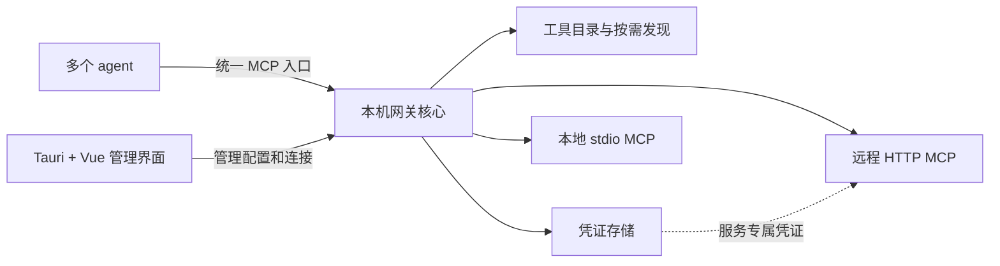

# 本地 MCP 管理器：需求与技术方向

核对日期：2026-09-06。状态：调研草案，尚未实现或完成真实 agent 联调。

后续用户已要求评估 Wails + Vue，并审核必要功能、菜单栏和 UI；当前审核入口为[产品审核稿](product-review.md)。本文的 Tauri 方案保留为此前候选，不代表已确定技术栈。

## 当前建议

优先验证 [MCPProxy](https://github.com/smart-mcp-proxy/mcpproxy-go) 能否直接满足使用需求。它的核心已是包含 Web UI 的单个二进制，macOS 另有菜单栏应用；工具发现已有检索、按需读取 schema 和实际调用链路。[项目说明](https://github.com/smart-mcp-proxy/mcpproxy-go#how-ai-agents-work-through-mcpproxy)

其官方文档明确描述了连接远程 MCP 的 OAuth 授权、刷新及 GUI 登录流程，而非仅验证进入网关的 JWT。[OAuth 文档](https://docs.mcpproxy.app/features/oauth-authentication/)

如果实际使用后发现管理体验有明确缺口，再复用该核心和已有 Vue 界面补 Tauri 桌面层；不因为技术栈偏好重复实现已经存在的聚合与认证能力。备选 [1MCP](https://github.com/1mcp-app/agent) 也有稳定的三个元工具入口，不过渐进模式需要显式开启。[1MCP 配置文档](https://docs.1mcp.app/guide/essentials/configuration#lazy-loading)

以上是选型建议，尚不表示这些项目已经通过本机验收；源码审查发现的具体边界见[开源项目调研](research-existing-projects.md)。

## 需求依据

已读完[最初讨论](https://chatgpt.com/share/6a9d50b5-9cf0-83ea-9e9a-cbcd764ac6a3)。该讨论最后收窄到本机聚合、OAuth2/token、渐进式发现，暂不要求项目隔离。本轮新增或强调可视化管理，并提出 Tauri + Vue 作为可选技术栈。

| 状态 | 内容 |
| --- | --- |
| 已确认需求 | 各 agent 的重复 MCP 配置集中维护；一个网关聚合多个 MCP；可视化管理；支持 OAuth2 和 token；按需发现工具以减少上下文占用 |
| 沿用原讨论的范围 | macOS 个人本机；目标客户端包括 OMP、Claude Code、Cursor、CodeBuddy、Codex；首版暂不按项目隔离 |
| 待决定 | 直接采用现有产品、在现有核心上增加桌面层，还是基于官方 SDK 自研；Tauri + Vue 尚不是必须重写已有界面的理由 |
| 待验证 | 用户实际 MCP 清单及认证提供方；五个客户端的安装版本、接入方式和发现效果；有状态 MCP 的实例共享方式 |

当前工作目录最初为空，无已有应用需要迁移。本轮没有修改用户的 agent 配置、凭证或开机启动项。

## 原讨论需要修正或补充的判断

1. **聚合入口与减少上下文是两个目标。** 网关读取上游工具目录可以发生在本机；只有被提供给模型的工具定义和调用结果才进入模型上下文。全量聚合后继续暴露全部 schema，仍可能扩大上下文。工具搜索可以作为独立入口；Code Mode 还增加代码执行和结果处理能力，两者不能等同。[Anthropic 工程说明](https://www.anthropic.com/engineering/code-execution-with-mcp)
2. **入站 JWT 验证不等于上游 OAuth 客户端。** agent → gateway 与 gateway → MCP 分别管理凭证。后者才涉及用户授权、凭证获取和刷新。stdio 子进程通常从环境接收服务所需凭证；MCP 的标准 OAuth 授权流程针对 HTTP 传输。[MCP 授权规范](https://modelcontextprotocol.io/specification/2026-07-28/basic/authorization)
3. **不能假定每个 OAuth 服务都允许动态注册。** 当前规范包含预注册、Client ID Metadata Documents 和兼容性的动态注册路径，必须按提供方能力选择；接入任意 OAuth2 服务并非仅填一个开关就能保证。[客户端注册规范](https://modelcontextprotocol.io/specification/2026-07-28/basic/authorization/client-registration)
4. **不要以搜索调用改变连接的工具列表来实现通用渐进发现。** 当前 2026-07-28 规范禁止 `tools/list` 因连接不同或其他调用的副作用而变化；按请求授权过滤是另一回事。稳定的少量发现/调用工具更容易跨客户端工作，仍须实测。[工具规范](https://modelcontextprotocol.io/specification/2026-07-28/server/tools)
5. **新的 `server/discover` 并不是语义工具搜索。** 它发现服务器身份、协议版本和能力，不能替代本产品的工具目录检索。[发现规范](https://modelcontextprotocol.io/specification/2026-07-28/server/discover)
6. **已经具备原生工具搜索的 agent 不必再套两层发现。** Claude Code 当前官方文档描述了原生延迟加载及适用条件。可以提供普通聚合模式与通用渐进模式，但不能据此推定所有目标 agent 都支持相同机制。[Claude Code MCP 文档](https://code.claude.com/docs/en/mcp#scale-with-mcp-tool-search)

原对话里的配置、scope、端口和 token 节省数量只是示例，不能直接当成当前可用配置或本产品测量结果。

## 建议的首版结构

优先验证现成网关能否覆盖需求，再补桌面体验。Tauri 支持打包外部二进制，因此选择 Tauri + Vue 不要求把已有网关改写成 Rust。[Tauri sidecar 文档](https://v2.tauri.app/develop/sidecar/)



这张图表示职责，不要求拆成多个服务。工具目录、路由和认证尽量留在现有网关核心内；管理界面调用它已有的 API。关闭窗口仍应能继续提供 MCP，完全退出是否停止后台由明确的运行方式决定，不把后台存活能力误认为 sidecar 自动提供。

如果候选核心都留下过大的缺口，再考虑 Rust 官方 `rmcp` SDK。它已有客户端/服务端和 OAuth 支持；SDK 不是现成聚合产品，连接管理、配置导入、凭证持久化和 GUI 仍需实现。[官方 Rust SDK](https://github.com/modelcontextprotocol/rust-sdk)、[OAuth 支持文档](https://github.com/modelcontextprotocol/rust-sdk/blob/main/docs/OAUTH_SUPPORT.md)

## 首版用户流程

| 流程 | 必须得到的结果 |
| --- | --- |
| 导入 | 粘贴或选择现有 MCP 配置，显示来源与差异，合并明确相同的连接；不同账号、参数、环境或工作目录不能仅凭同名就合并 |
| 管理 | 列出服务、传输方式、启停状态、认证状态、工具数、最近错误；支持编辑、连接测试和重连 |
| 认证 | token/API key 可用于指定 header 或子进程环境；OAuth 支持打开浏览器登录、取消、过期刷新和重新授权；普通配置只保留凭证引用 |
| 使用工具 | 人可以查看工具及参数；agent 默认只获得少量发现/调用入口；可查看一次调用实际落到哪个服务及工具 |
| 接入 agent | 为各客户端生成它实际支持的配置格式；只维护一个网关连接。迁移显示具体 diff 并保留可恢复备份 |
| 排错 | 分清未连接、未授权、没有匹配工具、参数错误、上游失败；日志默认脱敏，不记录完整 token 或敏感调用内容 |

普通配置文件和凭证库分开管理；macOS 首选系统 Keychain。无需为首版引入云数据库、团队账号系统、插件市场或多套注册中心。

## 通用渐进发现契约（建议，不是已实现 API）

优先复用所选网关已有的同类接口，下面的名称只说明交互职责。

```text
search_tools(query, limit)
  → 返回有限数量的 tool_id、服务名和简短说明

describe_tool(tool_id)
  → 只返回选中工具的完整参数定义、说明和行为提示

call_tool(tool_id, arguments)
  → 校验参数与当前权限，再调用对应上游工具
```

三个入口可保持稳定；搜索不修改 `tools/list`。同名上游工具使用网关分配的稳定服务标识区分，不能仅依赖远端自报的名称。检索先复用已有索引，验证关键词、中文意图和无匹配场景后，才决定是否需要 embedding 或额外模型。

调用层必须保留上游错误和受支持的 MCP 内容类型。通用 `call_tool` 会把多个真实操作包在同一个外层工具名下，权限和审计应继续识别真实目标；不能把它整体标记为只读或用一次“允许执行工具”绕过目标工具约束。

按需加载工具定义也不能保证大结果不会撑大上下文。第一阶段测量定义与结果两个部分，优先利用上游分页/查询限制；需要结果分块时应明确告知并提供继续读取方式，不能静默截断。

## 兼容性边界

- 传输与认证是两条轴：stdio、Streamable HTTP、旧版 HTTP+SSE 与无认证、静态 token、自定义 header、OAuth 分别列出支持情况。
- 新旧 MCP 协议并存，锁定候选版本和实际支持版本，交由 SDK/现成核心处理握手、元数据和结果格式，不手写 JSON-RPC 转发器冒充完整 MCP 兼容。当前规范也明确了旧版回退需求。[传输规范](https://modelcontextprotocol.io/specification/2026-07-28/basic/transports)
- “统一配置”不自动意味着“所有 agent 共用一个有状态实例”。浏览器会话、数据库事务等能力要核对原服务的状态模型，避免互相影响；不要求项目隔离，也不能默认状态共享总是正确。
- 先明确是否只验收 tools。resources、prompts、sampling、elicitation、MCP Apps 等能力未验证之前，不宣称全部透明代理。
- 本机服务绑定 loopback 并验证接入凭证及适用的 Origin/Host；网关凭证只用于网关，上游凭证只给对应上游。管理接口不作为任意 MCP 工具开放。[HTTP 传输要求](https://modelcontextprotocol.io/specification/2026-07-28/basic/transports/streamable-http)

## 选型验证的通过条件

以下是待执行的验收工作，不是本轮已完成结果。

1. 接入一个本地 stdio、一个带静态凭证的 HTTP MCP，以及用户实际使用的一个 OAuth MCP；测登录、刷新、重启后恢复和撤销后的提示。
2. 两个不同 agent 同时通过同一网关发现并调用工具；检查同名工具不会串路由，有状态工具不会相互覆盖。
3. 同一份工具目录分别测普通模式与渐进模式：记录初始暴露工具数量/schema 字节、单任务累计上下文用量、成功率、额外调用轮次与耗时。只有具备模型 tokenizer 或 usage 数据时才报告 token 数。
4. 增加/禁用工具后目录更新；搜索无结果能恢复；绕过搜索直接调用禁用工具仍被拒绝；上游断线不拖垮其他服务。
5. 验证候选核心保留图像/结构化结果、工具错误及当前需求所用的额外 MCP 能力；不支持的能力明确列为限制。
6. 分别验证五个客户端的真实接入配置。GUI 原型能显示数据、SDK 测试通过或 README 声称支持，都不能代替这一步。

## 下一步的选择原则

现有产品满足以上条件，就直接用；只缺桌面体验，就围绕其管理 API 加薄界面；核心行为存在无法小改的缺口，才自研。具体候选与代码证据见[开源项目调研](research-existing-projects.md)。
